# Architecture Documentation

## System Overview

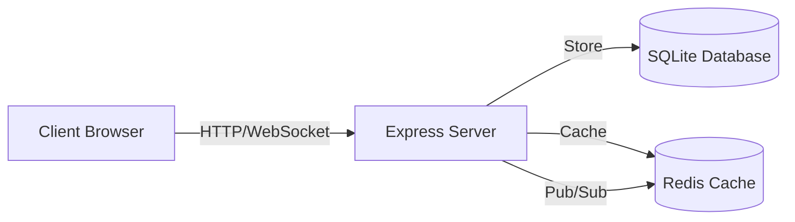

## Components Architecture

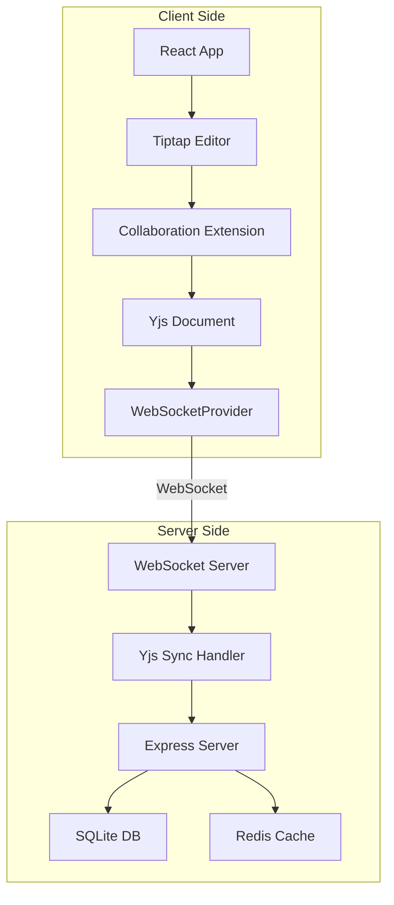

## Client Side

### Editor Component
- **Tiptap**: Rich text editor framework
- **Collaboration Extension**: Yjs integration for real-time sync
- **CollaborationCursor**: Shows other users' cursors
- **WebSocketProvider**: Connects to server via WebSocket

### State Management
- Yjs Document: Source of truth for editor content
- WebSocket Provider: Handles connection and sync
- React State: UI state (connection status, etc.)

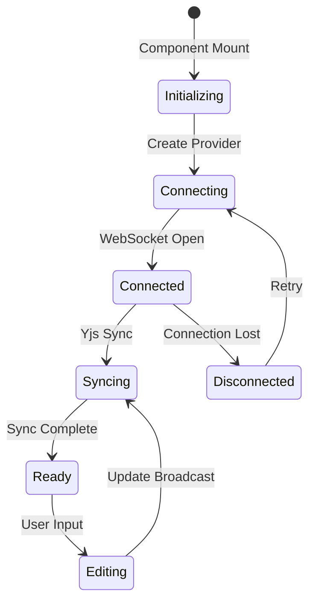

## Server Side

### Express Server
- REST API endpoints for document management
- WebSocket server for real-time collaboration
- SQLite database operations
- Redis cache operations

### Yjs Synchronization
- Receives updates from clients
- Broadcasts to all connected clients
- Persists to SQLite on changes
- Updates Redis cache

## Data Storage

### SQLite Database Schema

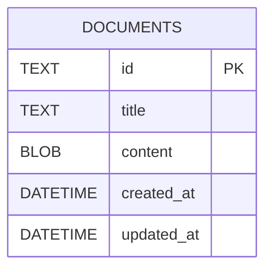

```sql
CREATE TABLE documents (
  id TEXT PRIMARY KEY,
  title TEXT NOT NULL,
  content BLOB,  -- Yjs binary updates
  created_at DATETIME,
  updated_at DATETIME
);
```

### Redis Cache Keys

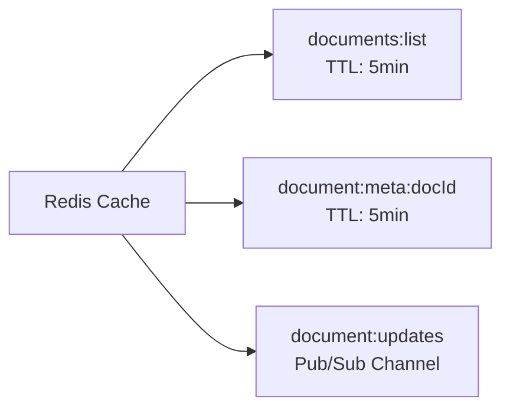

- `documents:list`: Cached document list (TTL: 5 min)
- `document:meta:<docId>`: Document metadata (TTL: 5 min)
- Pub/Sub channel: `document:updates`

## Real-time Synchronization Flow

### 1. Client Connects

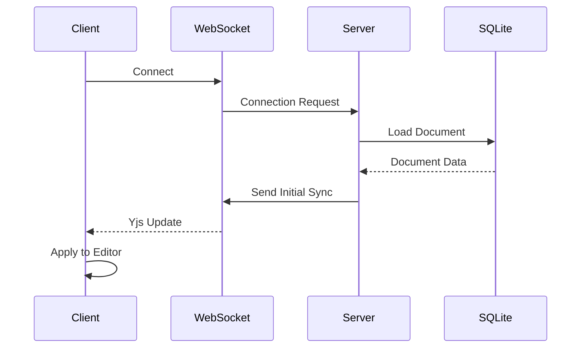

### 2. User Types

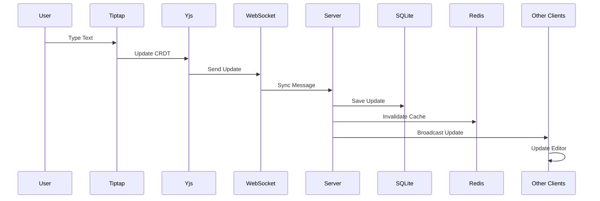

### 3. Other Clients Receive

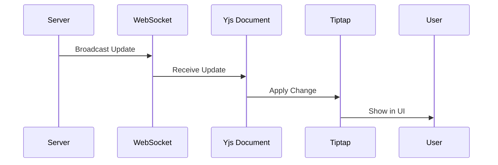

## CRDT (Conflict-free Replicated Data Types)

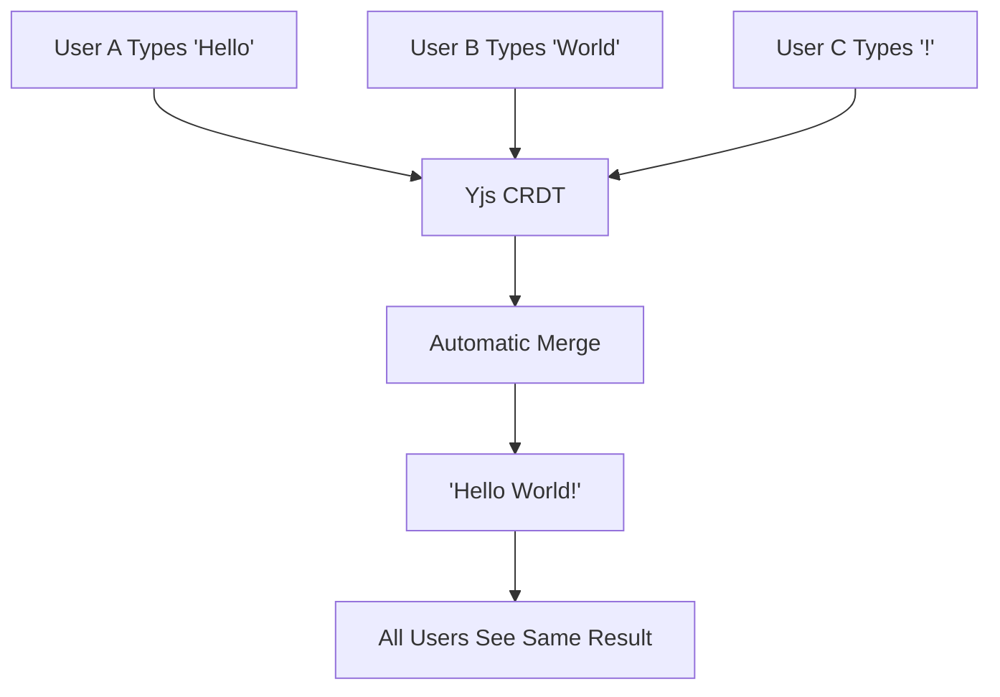

Yjs uses CRDTs to ensure:
- No conflicts when multiple users edit simultaneously
- Automatic merge of concurrent changes
- Eventual consistency across all clients
- Works even with network delays

## Performance Optimizations

### Redis Caching Strategy

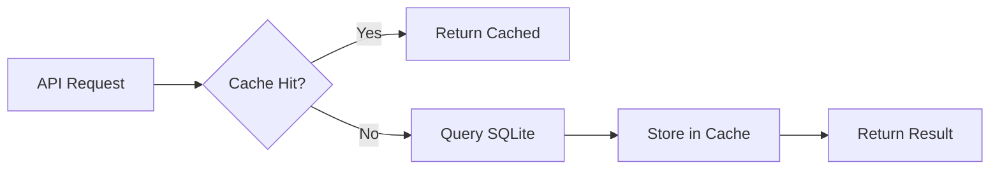

- Document list: Cached for 5 minutes
- Metadata: Cached per document
- Reduces SQLite queries

### WebSocket Efficiency
- Binary protocol (efficient)
- Incremental updates only
- Automatic compression

### Client-side
- useMemo for extensions
- Conditional rendering
- Efficient React updates

## Security Considerations

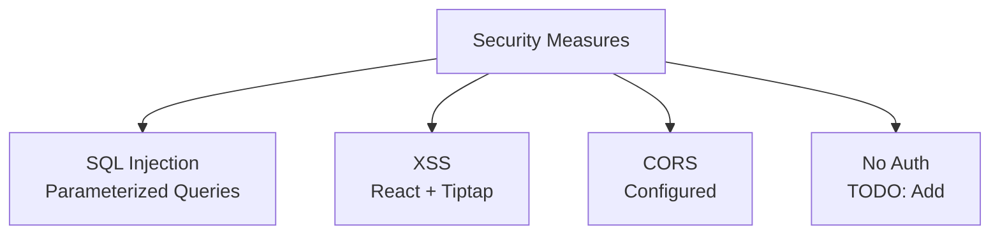

- No authentication (add if needed)
- No authorization (add if needed)
- SQL injection: Prevented by parameterized queries
- XSS: Handled by React and Tiptap
- CORS: Configured for development

## Scalability

### Current Limitations

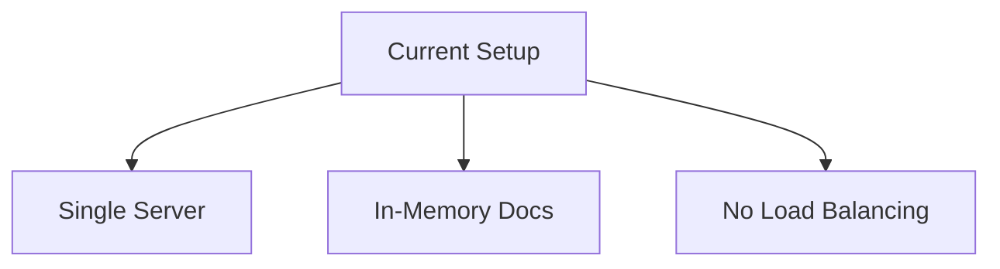

- Single server instance
- In-memory document storage (server restart = lost)
- No horizontal scaling

### Future Improvements

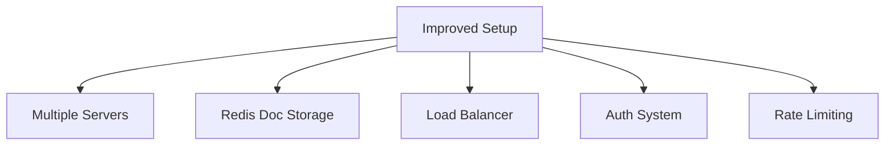

- Redis for document storage (shared across instances)
- Load balancer for multiple servers
- Authentication/authorization
- Rate limiting

## Error Handling

### Client Error Flow

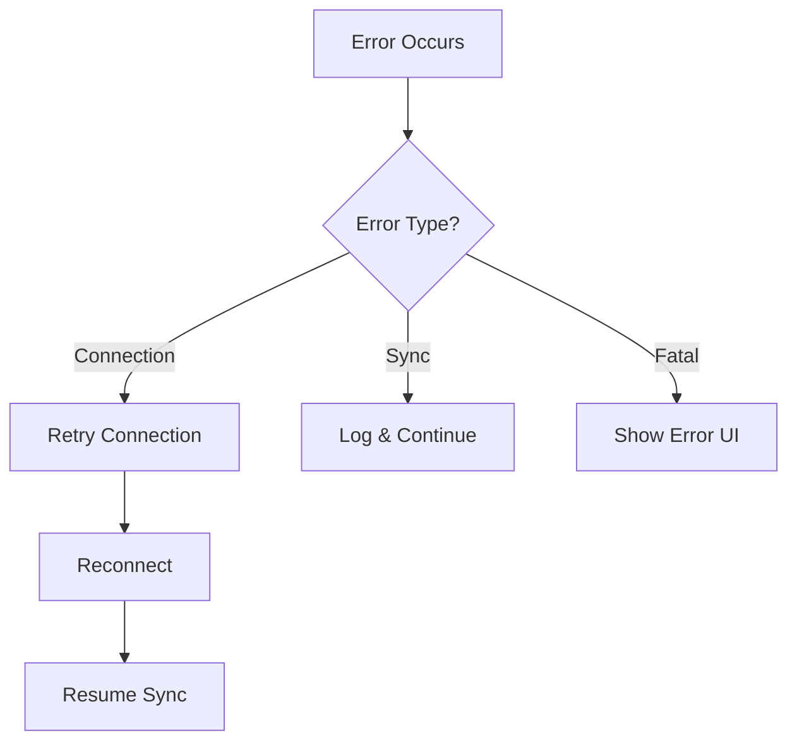

### Server Error Flow

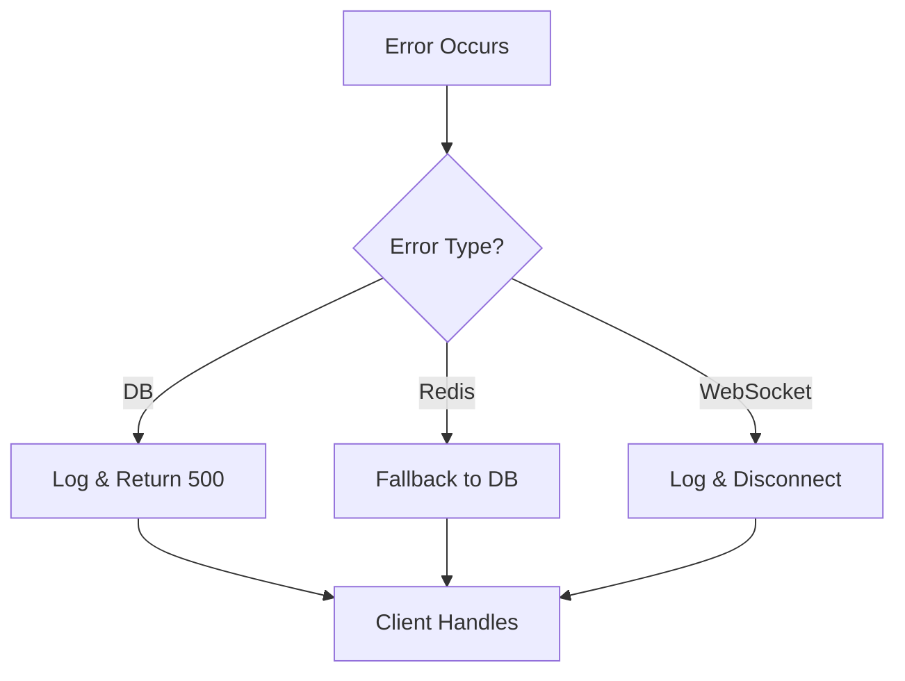

## Deployment Architecture

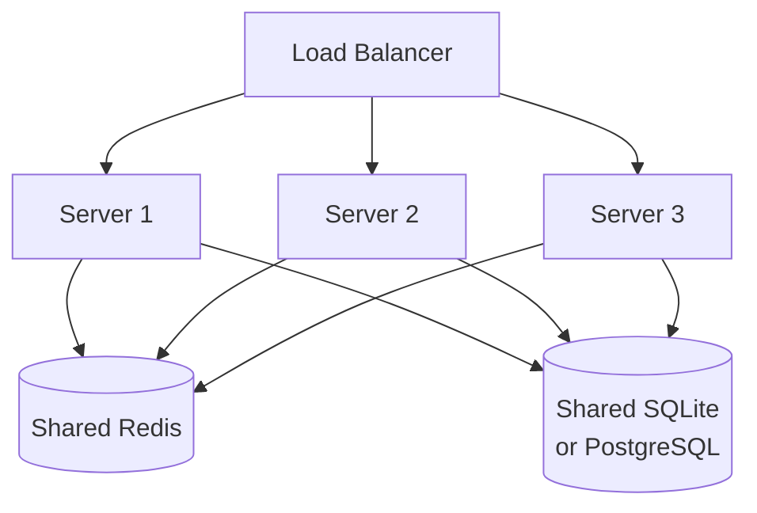
