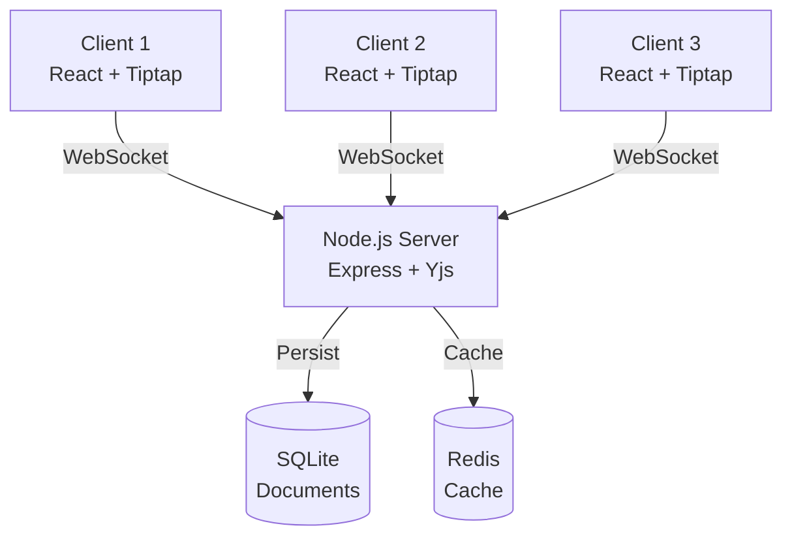
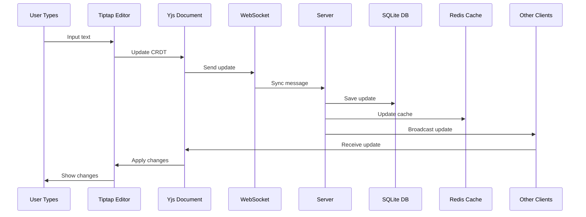

# Collaborative Document Editor - Documentation

## Overview

This is a real-time collaborative document editor built with modern web technologies. Multiple users can edit documents simultaneously with Notion-like rich text editing capabilities.

## System Architecture



## Architecture

### Frontend
- **React + Vite**: Fast development and build
- **Tiptap**: Notion-like rich text editor
- **Yjs**: Conflict-free replicated data types (CRDT) for real-time sync
- **WebSocket**: Real-time communication

### Backend
- **Node.js + Express**: REST API server
- **SQLite**: Persistent database for documents
- **Redis**: In-memory cache and real-time data storage
- **WebSocket Server**: Real-time synchronization

### Data Flow



## Features

### Real-time Collaboration
- Multiple users can edit simultaneously
- Conflict-free synchronization using CRDT
- Collaborative cursors show where others are editing

### Rich Text Editing
- Headings (H1, H2, H3)
- Lists (ordered and unordered)
- Bold and italic text
- Code blocks
- Blockquotes
- Notion-like UI

### Data Persistence
- **SQLite**: Long-term storage of document content
- **Redis**: Fast caching of document metadata
- Automatic saving on changes

## Setup

### Prerequisites
- Docker and Docker Compose
- Node.js 18+ (for local development)

### Quick Start with Docker

```bash
docker-compose up --build
```

Access at http://localhost:5173

### Local Development

```bash
# Install dependencies
npm run install:all

# Start development servers
npm run dev
```

## API Endpoints

### GET /api/documents
List all documents (cached in Redis)

### GET /api/documents/:id
Get document metadata

### POST /api/documents
Create a new document
```json
{
  "title": "Document Title"
}
```

### DELETE /api/documents/:id
Delete a document

## WebSocket Protocol

### Connection
```
ws://localhost:1234?doc=<document-id>
```

### Message Types
- `0`: Sync message (Yjs synchronization)
- `1`: Awareness message (cursor positions)

## Technology Stack Details

### Tiptap
- MIT Licensed
- ProseMirror based
- Extensible architecture
- Excellent Yjs integration

### Yjs
- CRDT implementation
- Automatic conflict resolution
- Efficient binary protocol
- Offline support

### Redis
- Used for:
  - Document list caching (5 min TTL)
  - Document metadata caching
  - Real-time update notifications (pub/sub)

### SQLite
- Stores document content as Yjs binary updates
- Auto-incremented timestamps
- Simple and reliable

## Development Notes

### Editor Component
- Waits for provider.awareness before initializing CollaborationCursor
- Uses useMemo to prevent unnecessary re-renders
- Gracefully handles connection states

### Server
- Handles WebSocket connections per document
- Broadcasts updates to all connected clients
- Saves updates to SQLite automatically

## License

MIT License - All dependencies are free and open source.
