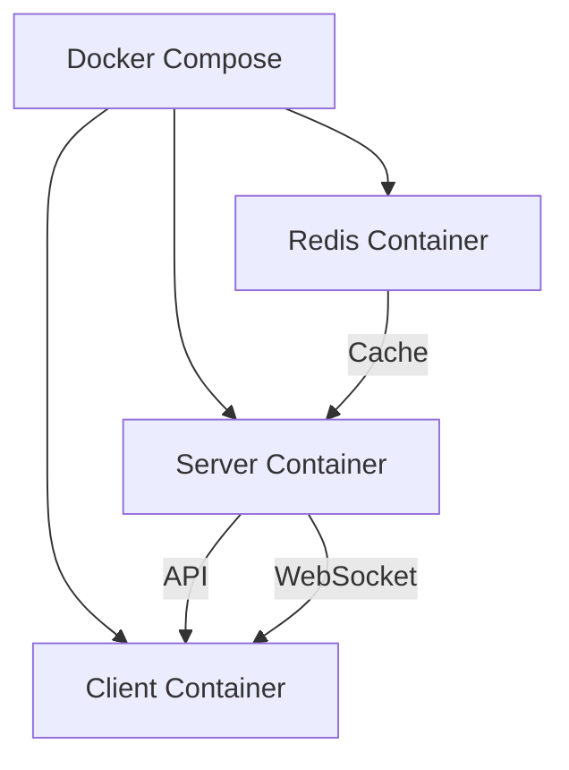
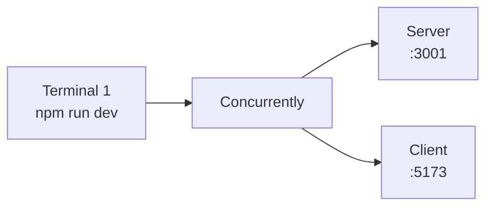
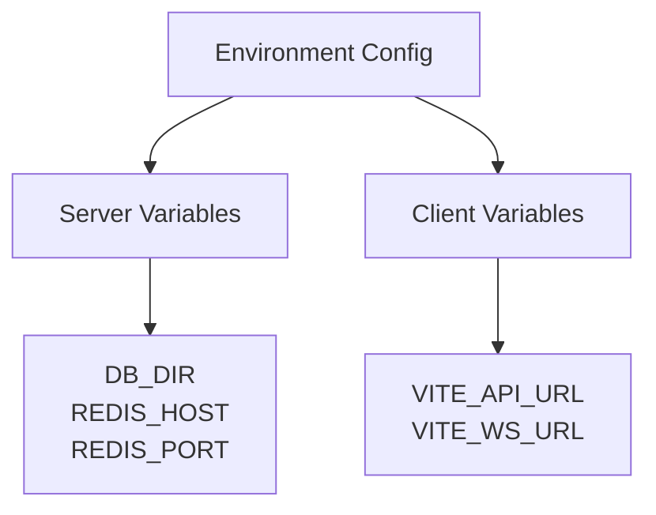
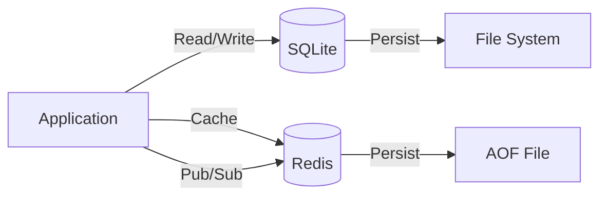
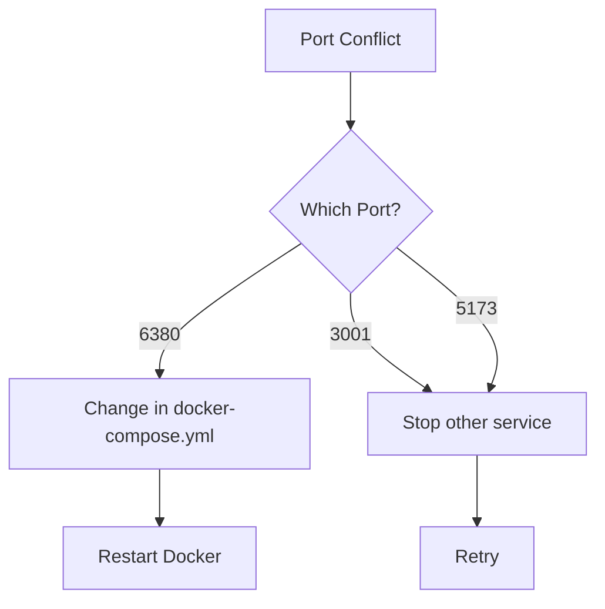
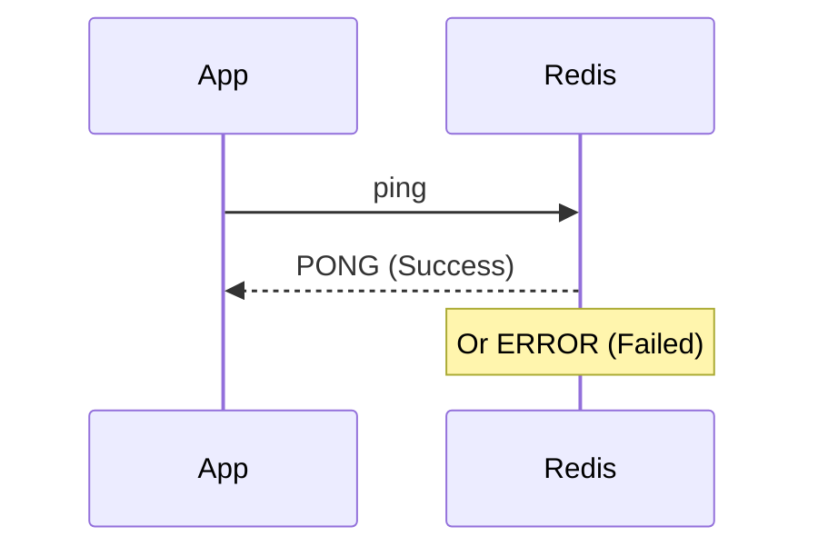
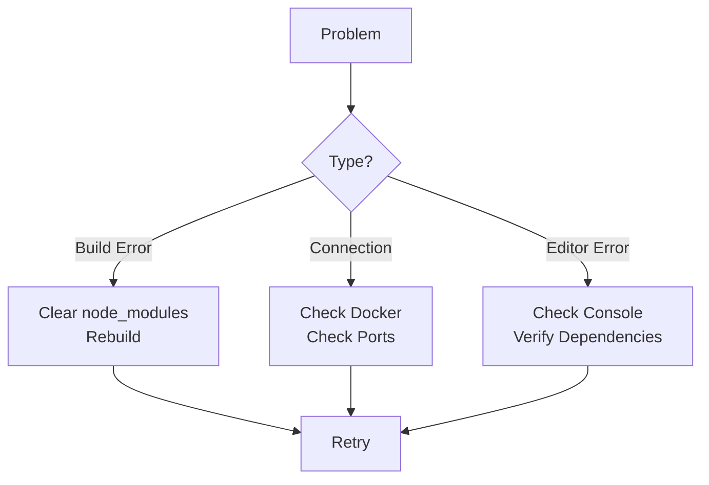

# Setup Guide

## Docker Setup

### First Time Setup

```bash
# Clone or navigate to project directory
cd collaborative-editor-sample

# Build and start all services
docker-compose up --build -d

# Check status
docker-compose ps

# View logs
docker-compose logs -f
```

### Service Architecture



### Accessing Services

- Frontend: http://localhost:5173
- Backend API: http://localhost:3001
- Redis: localhost:6380

### Stopping Services

```bash
docker-compose down
```

### Restarting Services

```bash
docker-compose restart
```

## Local Development Setup

### Install Dependencies

```bash
# Install root dependencies
npm install

# Install server dependencies
cd server && npm install

# Install client dependencies
cd ../client && npm install

# Or use the convenience script
npm run install:all
```

### Running Locally



#### Option 1: Run Everything Together
```bash
npm run dev
```

#### Option 2: Run Separately

Terminal 1 - Server:
```bash
cd server
npm run dev
```

Terminal 2 - Client:
```bash
cd client
npm run dev
```

Terminal 3 - Redis (if not using Docker):
```bash
docker run -d -p 6379:6379 redis:7-alpine
```

## Configuration

### Environment Variables



#### Server (.env or docker-compose.yml)
- `NODE_ENV`: development/production
- `DB_DIR`: Database directory path
- `REDIS_HOST`: Redis hostname (default: localhost)
- `REDIS_PORT`: Redis port (default: 6379)

#### Client (Vite environment)
- `VITE_API_URL`: Backend API URL (default: http://localhost:3001)
- `VITE_WS_URL`: WebSocket URL (default: ws://localhost:1234)

## Database

### SQLite
- Location: `server/database.db` (local) or `/app/data/database.db` (Docker)
- Auto-created on first run
- Stores document content as binary Yjs updates

### Redis
- Persistence: AOF (Append Only File) enabled
- Data location: Docker volume `redis-data`
- Used for caching and pub/sub



## Troubleshooting

### Port Already in Use



If port 6380 is in use, modify `docker-compose.yml`:
```yaml
ports:
  - "6381:6379"  # Change first number
```

### Redis Connection Issues



Check Redis is running:
```bash
docker-compose exec redis redis-cli ping
# Should return: PONG
```

### WebSocket Connection Issues
- Check server logs: `docker-compose logs server`
- Verify WebSocket port 1234 is accessible
- Check browser console for connection errors

### Editor Not Loading
- Check browser console for errors
- Verify provider.awareness is initialized
- Check network tab for WebSocket connection

### Common Issues and Solutions


